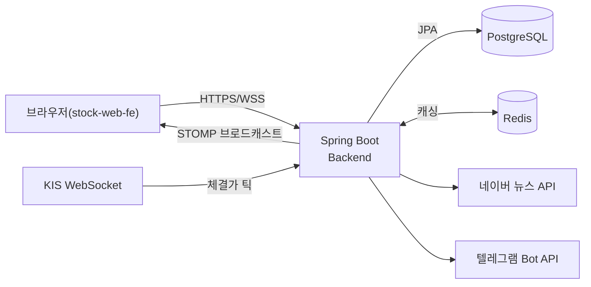

# Stock Market Service

관심종목 실시간 시세·뉴스·가격 알림을 제공하는 Spring Boot 백엔드입니다. 한국투자증권(KIS)
Open API로부터 실시간 체결가를 수신해 WebSocket(STOMP)으로 프론트엔드에 중계하고, Redis
캐싱·3분봉 적재·텔레그램 가격 알림까지 하나의 파이프라인으로 처리합니다.

- **라이브 데모**: https://app.finflow.pe.kr (프론트엔드는 별도 레포 [`stock-web-fe`](https://github.com/Yoosang/stock-web-fe))
- **API**: https://api.finflow.pe.kr

## 기술 스택

| 영역 | 사용 기술 |
|---|---|
| Language / Framework | Java 17, Spring Boot 4 |
| DB | PostgreSQL, Flyway (스키마 마이그레이션) |
| Cache | Redis (시세 캐싱, KIS 토큰 캐싱) |
| 인증 | Spring Security + JWT (httpOnly 쿠키) |
| 실시간 통신 | WebSocket + STOMP |
| 외부 연동 | 한국투자증권(KIS) WebSocket/REST API, 네이버 뉴스 검색 API, 텔레그램 Bot API |
| 문서화 | springdoc-openapi (Swagger UI) |
| 인프라 | Docker, Docker Compose, nginx, Let's Encrypt, AWS EC2, GitHub Actions |

## 시스템 아키텍처



## 핵심 기능

- **인증** — 이메일/비밀번호 회원가입·로그인, BCrypt 해싱, JWT를 httpOnly 쿠키로 발급/검증
- **관심종목** — 종목 추가/삭제(최대 10개), 실시간 시세가 반영된 목록 조회
- **실시간 시세** — KIS WebSocket 구독 → STOMP로 프론트엔드 브로드캐스트 → Redis 최신가 캐싱 → 3분봉(OHLC) 적재
- **가격 알림** — 종목별 목표가/등락률 임계값 설정, 조건 충족 시 텔레그램으로 1회성 알림(자동 비활성화)
- **뉴스** — 종목별 네이버 뉴스 검색 결과 조회
- **종목 마스터 동기화** — KOSPI/KOSDAQ 마스터파일을 주기적으로 upsert, 상장폐지 종목 자동 처리

## 기술적으로 신경 쓴 부분

**틱 하나가 여러 관심사를 거치는 실시간 파이프라인.** KIS WebSocket에서 체결가 틱이 오면
STOMP 브로드캐스트 → Redis 최신가 캐싱 → 3분봉 적재 → 가격 알림 평가가 한 틱 처리 경로 안에서
순차적으로 일어납니다. 텔레그램 전송처럼 지연이 발생할 수 있는 작업은 별도 스레드로 분리해
KIS 틱 수신 스레드를 블로킹하지 않도록 했습니다.

**인증 구조 재사용.** JWT를 httpOnly 쿠키로 발급하고, 이 쿠키를 일반 HTTP 요청 필터
(`JwtAuthenticationFilter`)와 STOMP 핸드셰이크(`JwtHandshakeInterceptor`) 양쪽에서 동일한
리졸버(`JwtAuthenticationResolver`)로 검증합니다. REST API든 WebSocket이든 인증 로직이 한
곳에 있습니다.

**크로스도메인 쿠키 문제 해결.** 프론트(Vercel)와 백엔드(EC2)를 처음엔 서로 다른 도메인으로
배포했는데, 맥북 Chrome에서는 정상 동작하던 로그인이 아이폰 Safari/Chrome에서만 로그인 직후
`/login`으로 튕기는 문제가 있었습니다. 원인은 iOS WebKit의 ITP(Intelligent Tracking
Prevention)가 `SameSite=None; Secure`로 정확히 설정한 쿠키라도 cross-site(서로 다른 도메인)면
third-party 쿠키로 간주해 저장 자체를 차단한다는 점이었습니다. 헤더 설정으로 우회할 수 없는
구조적 제약이라 도메인을 구매해 프론트/백엔드를 같은 등록 도메인의 서브도메인
(`app.finflow.pe.kr` / `api.finflow.pe.kr`)으로 재배치해 해결했습니다.

**1GB 메모리 인스턴스에서 안정적으로 운영.** AWS EC2 프리티어(RAM 1GB) 위에서 Spring Boot +
Postgres + Redis + nginx를 컨테이너로 동시에 띄우기 위해 JVM 힙을 `-Xmx384m`으로 제한하고,
빌드 시 OOM을 막기 위한 2GB 스왑을 구성했습니다. `main` 브랜치 푸시 시 GitHub Actions가 SSH로
접속해 컨테이너를 재빌드/재생성하는 배포 자동화도 구성했습니다.

## API 문서

Swagger UI에서 전체 API를 확인할 수 있습니다: https://api.finflow.pe.kr/swagger-ui/index.html

`/auth/login` 요청이 성공하면 브라우저에 httpOnly 쿠키가 심어져서, 같은 브라우저 세션에서
Swagger UI의 "Try it out"으로 인증이 필요한 엔드포인트도 바로 호출할 수 있습니다. (단,
`/stocks/{symbol}/news`는 실제 네이버 API를 호출하는 엔드포인트입니다.)

## 테스트

서비스 레이어의 핵심 비즈니스 로직을 Mockito 기반 단위테스트로 검증합니다(`./gradlew test`).

## 프로젝트 구조

레이어드 아키텍처(`api` / `application` / `domain` / `infra` / `global`)를 따르며, 각 레이어
안에서 도메인별(`auth`, `watchlist`, `stock`, `quote`, `alert`, `news`)로 나뉩니다.

```
com.usang.stockmarket
├── api          # REST 컨트롤러, 요청/응답 DTO
├── application  # 유스케이스/비즈니스 로직 (서비스 레이어)
├── domain       # JPA 엔티티, 리포지토리
├── infra        # 외부 연동 (KIS, 네이버, 텔레그램, JWT)
└── global       # 설정 (Security, WebSocket, Scheduling, OpenAPI)
```

## 트레이드오프

- **DB로 PostgreSQL을 선택**했습니다. JPA 기반이라 DB 벤더 종속적인 코드는 거의 없고, 로컬
  개발 편의성과 AWS 프리티어 비용을 우선한 선택입니다.
- **Kafka는 도입하지 않았습니다.** 단일 EC2 인스턴스로 운영하는 현재 규모에서는 캔들 집계
  경합이나 알림 중복 발송 같은 문제가 다중 인스턴스 환경에서만 실제로 발생하기 때문에,
  당장 필요하지 않은 복잡도를 추가하지 않는 쪽을 선택했습니다.
